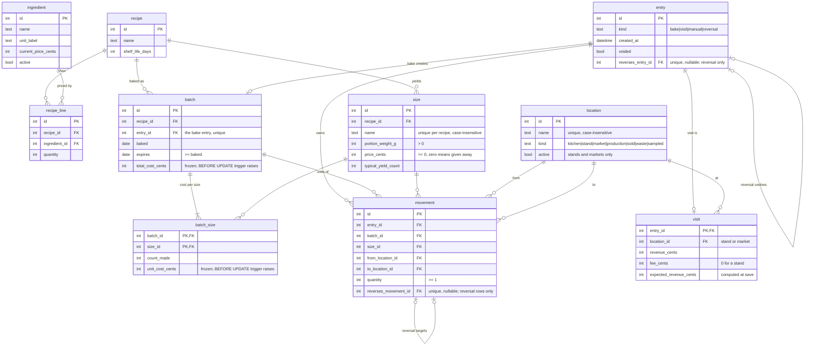

# Schema

Proposed persisted schema for the persistence slice, derived from [`data-model.md`](data-model.md). The data model is authoritative; this diagram is the descriptive shape the SQLAlchemy models and the initial Alembic migration follow. Money is integer cents (`_cents`), weights integer grams (`_g`).

## What the diagram cannot show

- **Nothing derived is stored.** There is no on-hand column; stock is always the fold over `movement`. Recipe cost per size is computed on read from current ingredient prices.
- **No deletes.** No ORM relationship cascades and no route deletes a row in any table. `ingredient` and user-created `location` rows carry `active`; every other row is permanent. Voiding an `entry` is the only lifecycle change, and it never edits or removes the entry's movements.
- **Built-ins by migration.** Kitchen, Production, Sold, Waste, and Sampled are rows created by the initial migration and cannot be renamed, deactivated, or deleted through the API.
- **Frozen cost.** A `BEFORE UPDATE` trigger on `batch.total_cost_cents` and `batch_size.unit_cost_cents` raises, so no write path (ORM, Core, or raw SQL) can change a recorded cost.
- **One transaction per write.** Recording a bake, visit, manual move, or undo loads on-hand, calls the domain planner, and appends `entry`, `movement`, and `visit` rows under `BEGIN IMMEDIATE` with a busy timeout, or writes nothing.
- **Per-size cost is a table.** `batch_size` holds `count_made` and `unit_cost_cents` per (batch, size) because a recipe yields several sizes; `batch.total_cost_cents` remains the authoritative record of what the batch cost, and the per-size sum may differ from it by the bounded rounding remainder.
